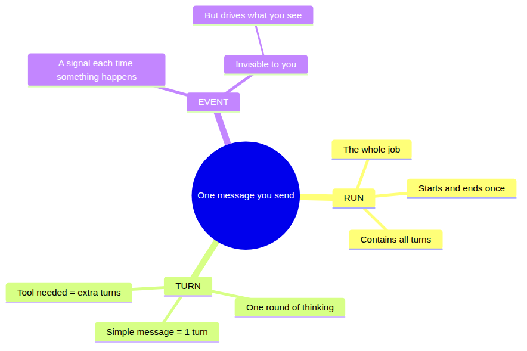
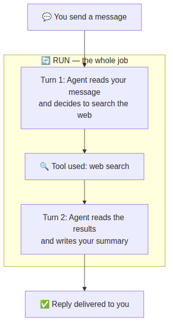
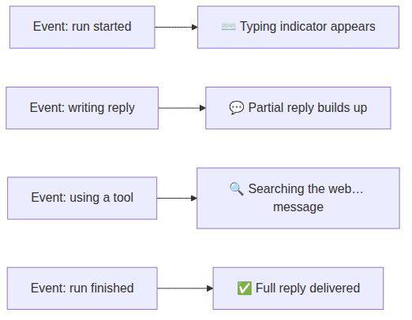

# Day 2 — How your Agent thinks: runs, turns, and events

Yesterday you learned the five pieces of OpenClaw. Today you look inside one of them — the Agent — and follow what actually happens between the moment you send a message and the moment a reply comes back.

Three words explain it: **run**, **turn**, and **event**. Once those click, you'll understand why your Agent sometimes replies in chunks, why it occasionally pauses before answering, and why it can handle complex multi-step tasks.

## The big picture

Imagine you're texting a very capable assistant. You send one message — say, "Book me a restaurant for Friday." That single message kicks off a whole chain of activity on the other end before a reply comes back to you.

That chain is what we're mapping today. Here's a concept map of how the three ideas connect before we go deeper:

## The three words

### Run — one job, start to finish

A **run** is everything that happens in response to one message you send. It starts the moment your message arrives and ends the moment the final reply is delivered. One message in = one run.

A run might take one second or thirty seconds depending on what's involved. But it's always one complete job.

**Analogy:** A run is like placing a food order at a restaurant. From the moment you tell the waiter what you want, to the moment the plate lands on your table — that's one run.

### Turn — one round of thinking

Inside a run, your Agent might need to think more than once. Each round of thinking is a **turn**.

If your message is simple ("What's the weather like?"), the Agent thinks once, writes a reply, done — that's one turn.

If your message requires the Agent to look something up first ("Book me a restaurant for Friday"), it might need two turns:
- **Turn 1:** "I need to find available restaurants — let me check." (uses a tool to search)
- **Turn 2:** "Here's what I found, and here's my recommendation." (reads the result, writes the reply)

Every tool the Agent uses adds at least one extra turn.

**Analogy:** Turns are the waiter's trips to the kitchen. A simple order might need one trip. A complicated order might need the waiter to check with the chef, come back, confirm an allergy, go back again — multiple trips, one order.

### Event — a signal along the way

An **event** is a small signal that gets sent each time something meaningful happens during a run. There are events for "started thinking," "starting to write," "used a tool," "finished," and more.

You don't usually see events directly — but they're what drives everything you *do* see: the typing indicator, partial replies appearing, the tool progress message ("Searching the web…"), the final answer.

**Analogy:** Events are like the kitchen display system in a restaurant — "order received," "chef started," "plate ready," "runner picking up." You don't see the display, but it's what makes the waiter show up at the right time.

## What this looks like in practice

Here's a simple example — you ask: *"Summarise today's news and send it to me."*

If the Agent didn't need to search anything, Turn 1 would go straight to writing the reply — no Turn 2 needed. If it needed to search *and* check your calendar, there might be three turns.

## What you see as the user

Depending on how your Agent is set up, you might see:

- **A typing indicator** while the Agent is thinking
- **Partial replies arriving in chunks** as the Agent writes (rather than waiting for the whole thing)
- **Tool progress messages** like "Searching the web…" or "Checking your calendar…" between turns
- **The final reply** once everything is done

These are all just different events being translated into things your messaging app can show you.

## The knobs that affect this

You can influence how runs and turns feel from inside a chat, without touching any config:

| What you type | What it does |
|---|---|
| `/verbose on` | Shows more detail about what the Agent is doing between turns (tool calls, progress) |
| `/verbose off` | Hides the extra detail, just shows the final reply |
| `/think` | Asks the Agent to show its reasoning — useful when you want to understand *why* it answered a certain way |
| `/reasoning stream` | Streams the Agent's reasoning to you as it thinks, before the reply |

These are session-level switches — they affect the current conversation and reset next time.

## Group chats: a practical tip

If your Agent is in a group chat and someone asks it a complex multi-part question involving several people, you might not want one big wall of text replying to everyone at once.

OpenClaw lets the Agent direct specific parts of its reply at specific people — each chunk is a separate quote-reply targeted at whoever it's responding to. Combined with the chunked streaming above, you get natural, conversational replies in groups rather than a broadcast monologue.

You don't need to configure this manually — it's driven by how you instruct the Agent in its personality files (more on that in later days).

## Reflect

Before moving on, check your understanding with these questions — no technical knowledge needed:

1. You send your Agent one message and get a reply back. How many runs happened?
2. Your Agent replies "Searching the web…" and then gives you an answer. How many turns were there at minimum?
3. You're in a group chat and the Agent's reply feels like a wall of text addressed to no one in particular. Based on today's content, which concept is most relevant to fixing that?

---
[← Day 1](day-01-five-piece-map.md) · [Course home](../README.md) · [Glossary](../glossary.md) · [Day 3 →](day-03-pi-engine.md)
