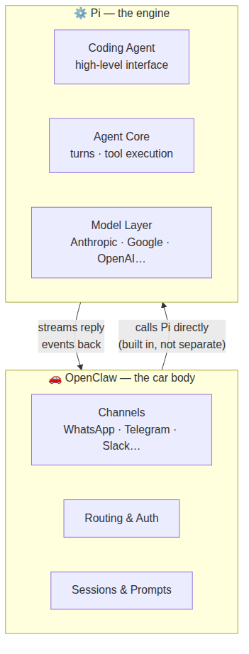

# Day 3 — Pi: the brain inside OpenClaw

## The one-line version

OpenClaw is responsible for messaging — receiving messages, routing them, sending replies. But the actual *thinking* — understanding your message, deciding what to do, using tools, generating a response — is handled by a separate piece called **Pi**. OpenClaw and Pi work together, but they have different jobs.

Today is about understanding what Pi is, why it's built in rather than bolted on, and what that means for you when something goes wrong.

## The engine and the car

Think of it like a car.

The **engine** (Pi) is what makes the car actually move. It handles combustion, power output, all the mechanical work. You don't interact with the engine directly — it just does its job.

The **car body** (OpenClaw) is everything around the engine: the steering wheel, the dashboard, the doors, the sat-nav. It decides where to go, who's driving, and how the journey feels. It uses the engine to move — but the engine doesn't care about any of that.

OpenClaw could not send a WhatsApp reply without Pi. Pi doesn't know what WhatsApp is — it just thinks and responds. They need each other.

## What Pi actually does

Pi handles everything you learned about in Day 2:

- Running each **turn** (round of thinking)
- Calling **tools** (web search, reading files, etc.)
- Streaming the **reply** back as it's written
- Managing **compaction** (when the conversation gets too long)

OpenClaw's job is to decide *when* to ask Pi to think, *what prompt to give it*, and *where to send the reply* once Pi is done.

## Built in, not bolted on

This is the most important thing to understand about how Pi works inside OpenClaw — and it answers a question you might not have thought to ask yet.

There are two ways you could connect an engine to a car:

1. **Bolted on** — the engine sits separately and you communicate with it by passing written notes back and forth. Slow, limited, awkward. If the engine needs to know something urgent, it has to wait for the next note.

2. **Built in** — the engine is physically part of the car, sharing the same space. Everything communicates instantly and directly.

OpenClaw uses the **built-in** approach. Pi is not a separate program that OpenClaw talks to — it's woven directly into OpenClaw itself. This is why:

- OpenClaw can give Pi custom tools (like "send a WhatsApp message") that Pi couldn't have on its own
- OpenClaw can intercept the reply mid-stream and format it for a specific channel
- The chunked, streaming replies from Day 2 work at all — they require direct, real-time communication

If Pi were bolted on (what engineers call a "subprocess"), OpenClaw would only get the finished reply as a big block of text at the end. No streaming, no tool customisation, no live typing indicators.

> **In plain terms:** "subprocess" means a separate program. "stdout" is the text a separate program prints out — like reading a printout rather than watching someone work live. OpenClaw skips all of that by having Pi work directly inside it.

## The four layers of Pi

Pi is actually made up of four layers stacked on top of each other. You don't need to know them in detail — but it's useful to know they exist:

| Layer | What it does |
|---|---|
| **Model layer** | Talks to AI providers (Anthropic, Google, OpenAI…) |
| **Agent core** | Runs the turn loop and tool execution |
| **Coding agent** | The high-level interface OpenClaw actually calls |
| **Terminal UI** | A chat interface Pi ships with (separate from OpenClaw) |

OpenClaw talks to the "Coding agent" layer and everything below it runs automatically.

## When something goes wrong

Knowing about Pi makes you much better at diagnosing problems. Almost every issue falls into one of two buckets:

**Pi problem** — something went wrong in the thinking itself:
- The model gave a strange or empty response
- The Agent went in circles and didn't finish
- Compaction (context management) behaved unexpectedly

**OpenClaw problem** — something went wrong in the messaging layer:
- The reply went to the wrong channel or person
- A tool wasn't available that should have been
- The Agent's personality or system prompt wasn't applied correctly

The quickest way to tell the difference: if the same question works fine when you chat with your Agent directly but breaks when it comes through WhatsApp or Telegram, it's an OpenClaw problem. If it breaks everywhere, it's likely Pi.

## Reflect

1. Your Agent gives a strange response — short, confused, nothing like its usual personality. Is this more likely a Pi problem or an OpenClaw problem? Why?
2. In your own words, why does OpenClaw build Pi in rather than run it as a separate program?
3. You've used the typing indicator feature before — now you know *why* it works. Which part of today explains it?

---
[← Day 2](day-02-agent-loop.md) · [Course home](../README.md) · [Glossary](../glossary.md) · [Day 4 →](day-04-harnesses.md)
