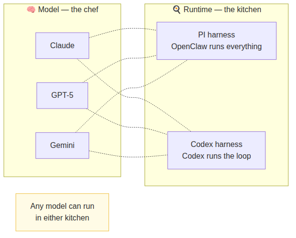

# Day 4 — Harnesses: how OpenClaw runs your AI

## The one-line version

When OpenClaw asks an AI to think, it needs to decide *how* to run that thinking. The piece responsible for that is called a **harness**. Today is about understanding what harnesses are, why there are two of them, and — most importantly — the single most common source of config confusion: **model and runtime are not the same thing**.

## Two things that look related but aren't

Before anything else, let's separate two settings that often get mixed up:

**The model ref** — *which AI you're using and how to authenticate.* Written as `provider/model`, for example `anthropic/claude-opus-4-6` or `openai/gpt-5.5`. This tells OpenClaw which brain to use and which login credentials to use to reach it.

**The runtime** (`agentRuntime.id`) — *how OpenClaw runs the thinking loop.* This is the method or plumbing. Changing the runtime changes how the turn is executed, not which AI does the thinking.

A good analogy: imagine ordering a meal.

- The **model ref** is which chef you've chosen and whether you're paying by card or voucher
- The **runtime** (`agentRuntime.id`) is which kitchen they're cooking in (your kitchen, their restaurant…)

Mixing them up is the number one source of confusion on this day — so keep that picture in mind.

### `openai/gpt-5.5` vs `openai-codex/gpt-5.5`

Same model, different login method. The prefix before the `/` is the **auth route** — how OpenClaw authenticates to reach the model.

- **`openai/gpt-5.5`** — uses an OpenAI **API key** (from platform.openai.com, pay per use)
- **`openai-codex/gpt-5.5`** — uses **Codex/ChatGPT OAuth** (log in with your ChatGPT account, subscription-based)

GPT-5.5 is the brain in both cases. The prefix only affects billing and login. This is also why the docs warn against combining `openai-codex/gpt-5.5` with `agentRuntime.id: "codex"` — `openai-codex` in a model ref means "use Codex OAuth login," while `codex` as a runtime means "use the Codex app's thinking loop." They sound related but are two completely separate settings.

## The two harnesses

OpenClaw ships with two built-in harnesses:

**PI harness** — the default. OpenClaw handles everything from start to finish: the conversation, the tools, the reply. This is what runs unless you change it. Most people use this and never need to think about it.

**Codex harness** — runs the thinking through the Codex app instead. Codex takes over the inner loop (the turns and tool calls from Day 2), while OpenClaw still handles everything around it — your channels, your sessions, your tools, your reply delivery.

Think of it this way:

| | PI harness | Codex harness |
|---|---|---|
| Who runs the thinking loop? | OpenClaw | Codex app |
| Who handles your channels? | OpenClaw | OpenClaw |
| Who manages your sessions? | OpenClaw | OpenClaw |
| Who sends the reply? | OpenClaw | OpenClaw |

Switching from PI to Codex only changes who runs the inner thinking loop. Everything else — your WhatsApp connection, your conversation history, your tools — stays exactly the same.

## The sticky rule

Once a conversation starts on a harness, it stays on that harness for the entire conversation. This is called a **runtime pin**.

If you start a conversation using PI and then change your settings to Codex, that existing conversation will still run on PI. The change only takes effect when you start a **new** conversation.

To start fresh: type `/new` in your chat. The next conversation will pick up the new settings.

This is intentional — it would be confusing if the AI's "engine" changed halfway through a conversation.

## What you actually need to configure

The config key is `agents.defaults.agentRuntime.id`. Most people don't need to touch it. If you're curious or troubleshooting:

| `agentRuntime.id` value | What it does |
|---|---|
| *(not set)* | Uses PI — OpenClaw handles everything |
| `"auto"` | OpenClaw picks the best harness automatically |
| `"pi"` | Forces the PI harness for all conversations |
| `"codex"` | Forces the Codex harness for all conversations |

The chat commands `/new` and `/reset` both start fresh — useful after you've changed `agentRuntime.id` and want the new setting to take effect on an existing conversation.

## A practical tip: two agents, two purposes

If you do use both harnesses, the cleanest setup is to have two separate Agents — one for each:

- **Main agent** — uses PI, works with any AI model, good for everyday tasks
- **Codex agent** — uses Codex, specialised for code-heavy work where you want Codex's native behaviour

You then just message the agent you want depending on the task. They never mix, which avoids the sticky-pin issue entirely.

## When things go wrong

The most common mistake: setting `openai-codex` as your model AND `codex` as your runtime at the same time. These two settings are doing overlapping jobs and OpenClaw will warn you. The fix is to pick one:

- If you want the Codex *app* to run the loop → set the runtime to `codex`, use a normal model ref
- If you just want to use OpenAI's model through the PI harness → set the model, leave runtime as default

## Reflect

1. You change your harness setting from PI to Codex in your config. You send a message. Which harness runs it — and why?
2. What's the difference between changing your model and changing your runtime? Use the chef/kitchen analogy.
3. When would you want two separate agents instead of one agent that switches harnesses?

---
[← Day 3](day-03-pi-engine.md) · [Course home](../README.md) · [Glossary](../glossary.md) · [Day 5 →](day-05-sessions.md)
