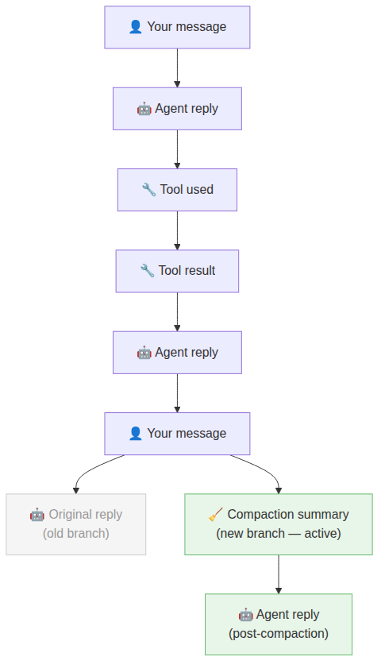

# Day 5 — Sessions and memory

You've seen it happen. A long conversation with your Agent, then suddenly:

> `🧹 Auto-compaction complete`

And the next reply feels a bit off — the Agent forgot the exact detail you mentioned earlier, or re-asked something you already answered. Today explains exactly what happened, why it's designed that way, and how to stay in control of it.

## What a session actually is

A **session** is a saved record of everything said in a conversation — your messages, the Agent's replies, and every tool it used along the way. It lives as a file on your device, so it persists even if you close the app.

What's less obvious: a session isn't stored as a flat list like a normal chat log. It's stored as a **tree** — where each message links back to the one before it.

Most of the time this tree is just a straight line (message → reply → message → reply…). But when the Agent retries something, branches off, or compacts history, the tree grows sideways. This is what makes it possible to keep old history archived without deleting it.

The key point: **nothing is ever permanently deleted from a session**. Old branches, old history, compacted summaries — they're all still in the file. The Agent just follows the most recent branch.

## The problem: conversations get too long

Every AI model has a limit on how much text it can hold in its head at once — called its **context window**. Your session file on disk can grow forever, but the model can only work with a slice of it at a time.

As conversations get longer, OpenClaw has to decide what to include in that slice. It has three tools for this:

### 1. History limiting
Before each reply, OpenClaw automatically trims how far back it looks in your conversation — keeping more history for direct messages (where continuity matters) and less for group chats (where conversations are noisier). You don't see this happening.

### 2. Compaction — summarising old history
When the conversation gets close to the model's limit, OpenClaw **compacts** it: an AI summarises the older parts of the conversation, and that summary replaces the full detail going forward.

This is what `🧹 Auto-compaction complete` means. It's not an error — it's OpenClaw keeping the conversation manageable. But it does mean fine details from early in the conversation may be summarised rather than remembered word-for-word.

### 3. Context pruning — trimming tool outputs
Tools (web searches, file reads, etc.) can return a lot of text. **Context pruning** quietly trims oversized tool results in memory after a few minutes, replacing them with shorter versions. Unlike compaction, this is temporary — it only affects what's in memory for the current turn, not the saved session file.

| | Compaction | Context pruning |
|---|---|---|
| What it trims | Old conversation history | Oversized tool results |
| Permanent? | Yes — writes a summary to the session file | No — in memory only |
| You see it? | Yes — `🧹 Auto-compaction complete` | No — silent |
| When it triggers | Near the model's context limit | After tool results sit unused for ~5 minutes |

## Staying in control

You don't have to wait for compaction to happen automatically. Two chat commands give you control:

**`/compact`** — triggers compaction right now, on your terms. You can even give it instructions: `/compact Focus on the decisions we made about the API design`. This way you choose when the summary boundary lands and what gets emphasised.

**`/new`** — starts a completely fresh session. No compaction, no summary, a clean slate. Use this when you're switching to something totally unrelated.

**When to use which:**
- Use `/compact` when continuity matters — you want to keep going but need to free up space
- Use `/new` when you're done with a topic and starting fresh

The worst time for compaction to happen is mid-turn (when the model hits the limit unexpectedly and OpenClaw has to compact and retry). If you're in a long session and about to shift topics, `/compact` first gives you control over the summary instead of leaving it to chance.

## The config terms you'll see

If you ever look at OpenClaw config or the docs, here are the key terms:

| Term | What it means |
|---|---|
| `compactionMode: "safeguard"` | Enhanced compaction that also summarises tool calls and file operations — more detailed summaries |
| `compaction.model` | Which AI model writes the compaction summary (can be different from your main model) |
| `contextPruning` | The tool-output trimming feature described above |
| `session.reset.idleMinutes` | Auto-start a new session after X minutes of inactivity |
| JSONL | The file format sessions are stored in — one line per message |

## Reflect

1. You're halfway through a long task with your Agent and it suddenly says `🧹 Auto-compaction complete`. What just happened, and what might it now be less precise about?
2. What's the difference between `/compact` and `/new` — and when would you choose each?
3. Why does OpenClaw keep old history in the file rather than deleting it when compaction runs?

---
[← Day 4](day-04-harnesses.md) · [Course home](../README.md) · [Glossary](../glossary.md) · [Day 6 →](day-06-system-prompt.md)
