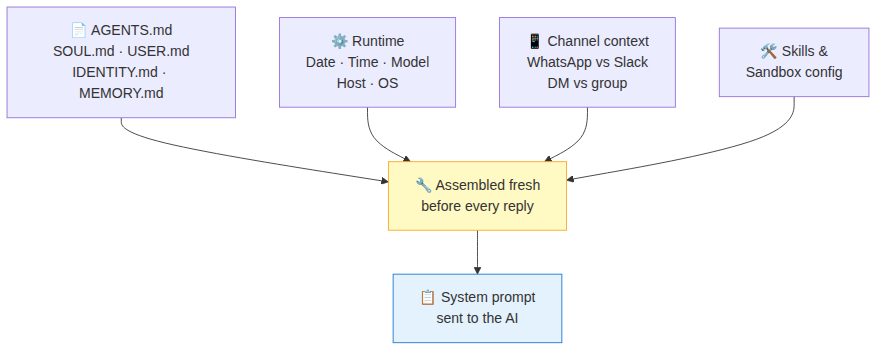

# Day 6 — The system prompt: assembled fresh every turn

You've edited `AGENTS.md` and noticed your Agent's personality changed. But have you wondered how it also knows your timezone, which channel you're on, and which skills are available — without you putting those in the file?

Today explains the system prompt: what it is, where it comes from, and why you can't find it as a single file on disk.

## What the system prompt is

Before every reply, OpenClaw sends the AI a **briefing** — a block of instructions that tells it who it is, what it's allowed to do, what tools it has, what channel it's on, and more. This briefing is called the **system prompt**.

The key thing to understand: **there is no single system prompt file**. It's assembled fresh before every reply from a dozen different sources. Your `AGENTS.md` is just one of them.

## What goes into it

OpenClaw pulls from these sources every turn, in a fixed order:

**From your workspace files** (the ones you can edit):
- `AGENTS.md` — your standing instructions for the Agent
- `SOUL.md` — its personality and tone
- `IDENTITY.md` — its name, vibe, emoji
- `USER.md` — who you are and your preferences
- `TOOLS.md` — guidance on how to use tools
- `MEMORY.md` — curated long-term memory (watch the size — it counts against context every turn)

**From runtime** (OpenClaw fills these in automatically):
- Current date and time (from your timezone setting)
- Which AI model is running
- Which channel the message came from (WhatsApp, Slack, CLI…)
- Whether you're in a direct message or a group chat
- What thinking level is active
- Host and OS info

**From config** (what you've set up):
- Which skills are available for this agent on this channel
- Sandbox settings (what the Agent is and isn't allowed to access)
- Any channel-specific tone additions (e.g. terser on Slack, more conversational on WhatsApp)

All of these are assembled together into the final briefing before each reply. That's why the Agent "just knows" your timezone and channel — it's always in the briefing.

## Why the same agent behaves differently on different channels

Because the assembled prompt is different. Your Slack and WhatsApp prompts share the same `AGENTS.md` and `SOUL.md`, but the channel context section differs — and if you've set channel-specific tone additions, those only appear on the relevant channel.

This is intentional. You might want your Agent to be concise and emoji-light on Slack (professional context) but chattier on WhatsApp (personal context). You control that through channel config without changing the core personality files.

## Three layers, three lifetimes

A useful way to think about it:

| Layer | Where it lives | Changes how often |
|---|---|---|
| **Stable personality** | `AGENTS.md`, `SOUL.md`, `USER.md`… | Rarely — these are your standing instructions |
| **Surface-specific tone** | Channel config | When you want different behaviour per channel |
| **One-off context** | Runtime overrides (e.g. webhooks) | Per-request — injected for a single turn only |

The rule: if it should be true on every turn forever, it goes in a workspace file. If it should only apply on one channel, it goes in channel config. If it's needed just once for a specific request, it's a runtime override.

## What you can actually control

The files in your workspace are the main thing you can edit. A few practical notes:

- **`MEMORY.md`** is the one to watch — it gets injected every turn and counts against your context limit. Keep it concise.
- **`AGENTS.md`** is the most powerful — it's the first thing the Agent reads every session.
- Skills only appear in the prompt if they're enabled for that agent and that channel.
- If the prompt gets too big (from large workspace files), OpenClaw will truncate them and warn you.

## Seeing it for yourself

Type `/context list` in any chat to see the headline numbers for the last turn's prompt — how many characters came from the system prompt, from your workspace files, from skills, etc.

Type `/context detail` for a breakdown by section. You can see exactly where each piece came from.

## Reflect

1. Your Agent knows you're in London and it's Tuesday morning, even though you never mentioned it. Where did that come from?
2. You want your Agent to be more formal on Slack but keep its usual personality everywhere else. Which layer do you change — a workspace file or channel config?
3. What's one reason to keep `MEMORY.md` short?

---
[← Day 5](day-05-sessions.md) · [Course home](../README.md) · [Glossary](../glossary.md) · [Day 7 →](day-07-end-to-end-trace.md)
